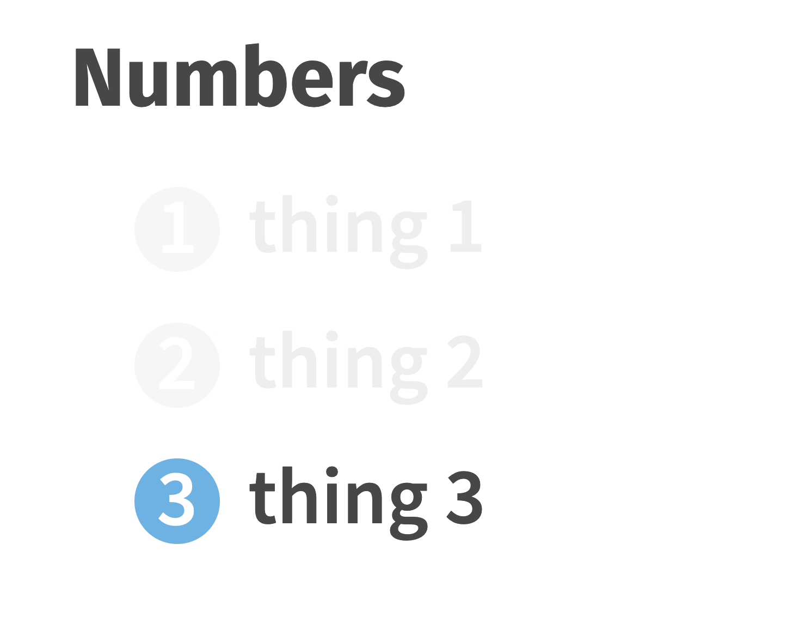
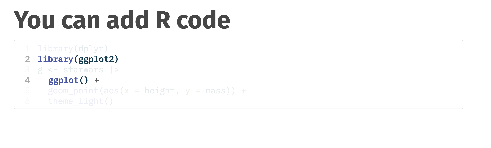
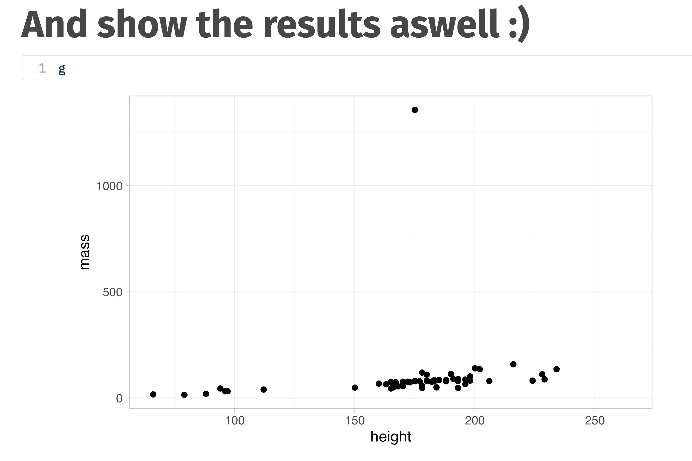

# Quarto Kakashi Theme

This repository contains a translation of the [xaringan kakashi theme](https://github.com/malcolmbarrett/kakashi) into [Quarto and reveal.js](https://quarto.org/docs/presentations/revealjs/). 

kakashi has a clean look with a [color-blind friendly palette](https://github.com/malcolmbarrett/ggokabeito).

Marking text as italics (*) will turn it blue, bold (**) will turn it orange, and striking out (~~) will turn it grey.

kakashi copies ideas from many other xaringan themes, including metropolis and lucy, but is ultimately unique. That is why this CSS (copy shinobi style) is called kakashi, [after the copy ninja](https://www.wikiwand.com/en/Kakashi_Hatake).

The Quarto theme also includes several improvements to the xaringan version:
* Automatically gray-out bullets when incrementing through them

* Opinionated code highlighting for teaching

* [Principled knitr settings](https://github.com/malcolmbarrett/kakashi-quarto-theme/blob/7f55625cc24fa862ae0ca88fe3a14b0786a62995/_extensions/kakashi/_extension.yml#L7-L18) for figure output


## How to install

This [Quarto](https://quarto.org) extension can be installed using the following command:

``` bash
quarto install extension malcolmbarrett/kakashi-quarto-theme
```

## How to use it

After you install the template, use the following code on terminal to create a new directory with all files needed:

``` bash
quarto use template malcolmbarrett/kakashi-quarto-theme
```

If you want to use the theme across a project, install the theme in the root directory and set up a [Quarto project](https://quarto.org/docs/projects/quarto-projects.html).

## Thanks!

My thanks to [Bea Milz](https://beamilz.com/) and [Emil Hvitfeldt](https://www.emilhvitfeldt.com/), on whose Quarto themes for [R-Ladies](https://github.com/beatrizmilz/quarto-rladies-theme) and [nes.css](https://github.com/EmilHvitfeldt/quarto-nes-theme) I leaned on heavily.

In fact, this repo is a sort-of-fork of the Bea's repo, because I didn't know you could do this to start a fresh Quarto template extension:

```bash
quarto create extension format:revealjs
```


